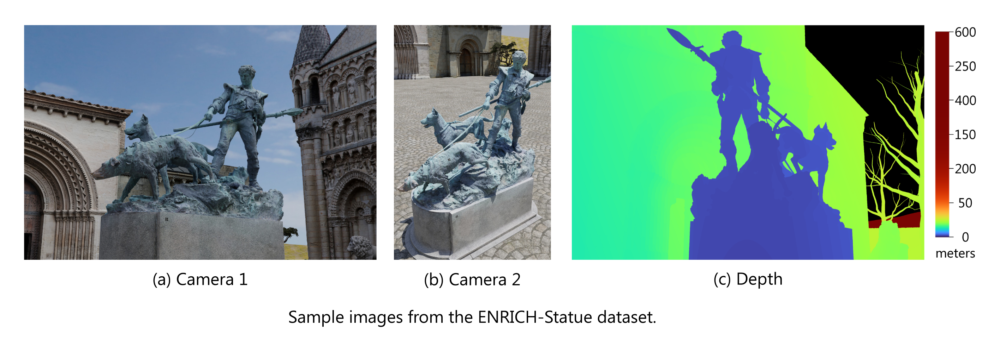

# ENRICH: multi-purposE dataset for beNchmaRking In Computer vision and pHotogrammetry

Authors:
  [Davide Marelli](http://www.ivl.disco.unimib.it/people/davide-marelli/) ¹,
  [Luca Morelli](https://3dom.fbk.eu/people/profile/luca-morelli) ² ³,
  [Elisa Mariarosaria Farella](https://3dom.fbk.eu/people/profile/eliarella) ²,
  [Simone Bianco](http://www.ivl.disco.unimib.it/people/simone-bianco/) ¹,
  [Gianluigi Ciocca](http://www.ivl.disco.unimib.it/people/gianluigi-ciocca/) ¹,
  [Fabio Remondino](https://3dom.fbk.eu/people/profile/remondino) ²

  ¹ Imaging and Vision Laboratory (IVL), Department of Informatics, Systems and Communication, University of Milano-Bicocca, Viale Sarca 336, Milano, 20126, Italy  
  ² 3D Optical Metrology (3DOM) unit, Bruno Kessler Foundation (FBK), Via Sommarive 18, Trento, 38123, Italy  
  ³ Dept. of Civil, Environmental and Mechanical Engineering (DICAM), University of Trento, Via Mesiano 77, Trento, 38123, Italy

Version 1

[Download ENRICH](https://doi.org/10.17632/md7f7c5pzn.1)

This file contains information about the structure and contents on the ENRICH datasets. Please refer to the related paper for information about the generation method and the purpose of ENRICH.


## Folder structure

Each zip file in the root is relative to a specific dataset:

- **ENRICH-Aerial** is an aerial image block of the city of Launceston, Australia. The acquisition is performed by simulating a typical oblique aerial camera with five views (nadir and four oblique views).
- **ENRICH-Square** is a ground-level dataset of a square captured by four cameras, each one moving on a different path, with different focal length, orientation, and lighting conditions.
- **ENRICH-Statue** is a ground-level dataset portraying a statue (placed in the center of the ENRICH-Square scene), acquired using four cameras.

Each dataset uses the following folder structure:

```text
ENRICH-<Dataset Name>
|   README.pdf
│   cameras.csv            # cameras extrinsic parameters in Comma-Separated Values (CSV) format
│   cameras.tsv            # cameras extrinsic parameters in Tab-Separated Values (TSV) format
│   gcp_images_list.csv    # Ground Control Points (GCPs) visibility and 2D image location, CSV format
│   gcp_images_list.tsv    # GCPs visibility and 2D image location, TSV format
│   gcp_list.csv           # 3D location of GCPs, CSV format
│   gcp_list.tsv           # 3D location of GCPs, TSV format
│   gcp_placement.jpg      # preview image of GCPs placement in the 3D scene
│
├── 3D
│   ├── geometry
│   │   │   <Dataset Name>.obj                # 3D model in Wavefront OBJ format
│   │
│   └── geometry+materials
│       │   <Dataset Name>.obj                # 3D model in Wavefront OBJ format
│       │   <Dataset Name>.mtl                # materials definition library file
│       │   ... <texture files> ...           # additional texture files
│
├── depth
│   ├── exr
│   │   │   <Frame>_<Camera Name>_depth.exr   # 32bit float depth
│   │   │   ...
│   │
│   └── png-preview
│       │   <Frame>_<Camera Name>_depth.png   # colorized depth preview
│       │   ...
│       │   lut.png                           # colors look-up table
│
└── images
    │   <Frame>_<Camera Name>.jpg             # RGB images
    │   ...
```


## Files content

### cameras.csv/tsv

This file describes the pose of the cameras using the following fields:

```text
label      ── string, the filename of the image to which the entry refers, file extension included
position_x ┐
position_y ├─ three float numbers representing the global position of the camera
position_z ┘
omega      ┐
phi        ├─ Omega, Phi, Kappa angles defining the rotation of the camera. Three floats, angles in radians
kappa      ┘
yaw        ┐
pitch      ├─ Yaw, Pitch, Roll angles defining the rotation of the camera. Three floats, angles in radians
roll       ┘
rotation_w ┐
rotation_x ├─ four floats, representing the camera rotation quaternion
rotation_y │
rotation_z ┘
lookat_x   ┐
lookat_y   ├─ three floats, representing the camera look-at direction vector
lookat_z   ┘
```

> The values are defined according to a global coordinate reference system, having X growing right/east, Y growing forward/north, and Z growing upward/zenith. Transformations are meant to translate and rotate the camera in this global reference system.  
> Omega, Phi, and Kappa are counterclockwise (CCW) local rotations along the X, Y, and Z axes, applied in the following order $R=R_x \cdot R_y \cdot R_z$.  
> Pitch and Roll are CCW local rotations along the X and Y axes respectively, and Yaw is a clockwise (CW) local rotation along the Z axis. The order of application is $R=R_z \cdot R_x \cdot R_y$.

### gcp_images_list.csv

This file reports the 2D coordinate of the GCP center in the images where the GCP is visible. The fields are:

```text
image_name ── string, the filename of the image that portrays the GCP
gcp_name   ── string, unique identifier of the GCP
image_u    ┬─ two floats, u and v coordinate of the center of the GCP in the image
image_v    ┘
```

> The GCP coordinates are relative to its center; coordinates start at $(0,0)$, which is the top-left corner of the top-left pixel in the image, and end at $(6016,4016)$, which is the bottom-right corner of the bottom-right pixel in the image. $u$ grows right, and $v$ grows downward.

### gcp_list.csv

This file contains the position of the GCPs in the scene. The available fields are:

```text
gcp_name   ── string, unique identifier of the GCP
x_east     ┐
y_north    ├─ three floats, representing the global coordinates of the center of the GCP in the scene
z_altitude ┘
type       ── string, shape of the GCP, may be either `cross` or `round`
```

> The 3D global coordinate reference system is defined as in Section [cameras.csv/tsv](#camerascsvtsv).

### 3D geometry

3D geometry for all datasets is provided as Wavefront OBJ files.
Folder `ENRICH-<Dataset Name>/3D/geometry` includes only an OBJ file with the 3D geometry of the scene.
Folder `ENRICH-<Dataset Name>/3D/geometry+materials` includes the geometry and the materials (MTL definition file and textures) as well.

### Depths

EXR files are used to store the depth ground truth for each color image.
Metric depths are available as 32bit float values in folder `ENRICH-<Dataset Name>/depth/exr`.

Colorized depth previews are stored as PNG files (folder `ENRICH-<Dataset Name>/depth/png-preview`).  
The lookup table with the color used is stored in the file `ENRICH-<Dataset Name>/depth/png-preview/lut.png`.  
The `ENRICH-Statue` and `ENRICH-Square` datasets use a logarithmic color map that covers the range $[0,600]$ meters applying a different color every 0.25 meters of depth.
The `ENRICH-Aerial` uses instead a linear color map that covers the range $[114,300]$ meters applying a different color every 0.25 meters.
In all cases, black color is used for pixels whose depth is at infinity (i.e. sky).

### Images

All the images are acquired at resolution 6016×4016px (24MP) by a virtual perspective (pinhole) camera that uses the configuration of the Nikon D750 DSLR full-frame camera with sensor size 35.9×24mm and a pixel size of 5.95µm. The images do not present lens distortion.

Focal Length, as well as image count, orientation, lighting setup, and average Ground Sample Distance (GSD), are summarized in the Table of Section [Acquisition setup](#acquisition-setup).

All the images are available as JPEG files with the following metadata (EXIF version 2.30) fields set:

```text
Exif:Make                     ── NIKON CORPORATION
Exif:Model                    ── NIKON D750
Exif:XResolution              ── 1
Exif:YResolution              ── 1
Exif:FocalLength              ── <varying>mm
Exif:FocalLengthIn35mmFormat  ── <varying>mm
Exif:FocalPlaneXResolution    ── 1680
Exif:FocalPlaneYResolution    ── 1680
Exif:FocalPlaneResolutionUnit ── cm
Exif:ExifImageWidth           ── 6016px
Exif:ExifImageHeight          ── 4016px
Exif:ExifVersion              ── 0230

XMP:GPSLatitude               ── <varying>m
XMP:GPSLongitude              ── <varying>m
XMP:GPSAltitude               ── <varying>m
XMP:GPSAltitudeRef            ── Above Sea Level

GPS:GPSAltitude               ── <varying>m
GPS:GPSAltitudeRef            ── Above Sea Level
GPS:GPSImgDirectionRef        ── True North
GPS:GPSImgDirection           ── [0, 359.99]°, Yaw
GPS:GPSPitch                  ── [-180, +180]°, Pitch
GPS:GPSRoll                   ── [-180, +180]°, Roll
```

> For more information about the metadata refer to [Cipa EXIF specification](http://www.cipa.jp/std/documents/e/DC-008-2012_E.pdf).  
> The 3D coordinate reference system is defined as in Section [cameras.csv/tsv](#camerascsvtsv).  
> GPS fields are used to store coordinates in that reference system; no actual GPS coordinates are used.


## Acquisition setup

The following subsections describe the scene and camera setup used in the three datasets of ENRICH.  
Focal length, image count, orientation, lighting setup, and average Ground Sample Distance (GSD) are summarized in the Table here below.

|  Dataset     | Camera   | Focal Length    | Images | Orientation          | Lighting Setup | GSD    |
|:------------:|:--------:|:---------------:|:------:|:--------------------:|:--------------:|:------:|
|Enrich-Aerial | nadir    | 35mm /  5,882px | 60     | Landscape            | Uniform light  | 2.5cm  |
|              | forward  | 70mm / 11,764px | 60     | Landscape            | Uniform light  | 1.8cm  |
|              | backward | 70mm / 11,764px | 60     | Landscape            | Uniform light  | 1.8cm  |
|              | right    | 70mm / 11,764px | 60     | Landscape            | Uniform light  | 1.8cm  |
|              | left     | 70mm / 11,764px | 60     | Landscape            | Uniform light  | 1.8cm  |
|              | nadir 2  | 35mm /  5,882px | 39     | Landscape            | Uniform light  | 3.0cm  |
|                                                                                               |||||||
|ENRICH-Square | camera 1 | 35mm /  5,882px | 50     | Landscape & Portrait | Partly cloudy  | 0.8cm  |
|              | camera 2 | 50mm /  8,403px | 50     | Landscape            | Clear sky      | 0.5cm  |
|              | camera 3 | 35mm /  5,882px | 50     | Landscape & Portrait | Sunrise        | 0.8cm  |
|              | camera 4 | 35mm /  5,882px | 50     | Landscape            | Clear sky      | 1.0cm  |
|                                                                                               |||||||
|ENRICH-Statue | camera 1 | 50mm /  8,403px | 50     | Landscape            | Partly cloudy  | 0.69mm |
|              | camera 2 | 35mm /  5,882px | 50     | Portrait             | Clear sky      | 0.64mm |
|              | camera 3 | 50mm /  8,403px | 50     | Landscape            | Sunrise        | 0.70mm |
|              | camera 4 | 35mm /  5,882px | 50     | Portrait             | Cloudy         | 0.64mm |

### ENRICH-Aerial

The ENRICH-Aerial dataset is generated from an aerial image block of the city of Launceston, Australia. A total of 26 GCPs of size 50×50cm are positioned in the scene on flat or almost-flat surfaces at different elevations. The acquisition is performed by simulating a typical oblique aerial camera with five views: one nadir and four oblique views (forward, backward, left, and right). The oblique cameras have an angle of 45° w.r.t. the nadir direction. The five cameras are rigidly mounted on a virtual flying platform at the same altitude, with the oblique ones having a 20cm padding from the nadir camera in their viewing direction. The image acquisitions followed six parallel strips, with ten acquisition points in each track, providing a total of 300 images. A second acquisition pass orthogonal to the first one, is performed using only the nadir camera (nadir-2). This pass uses three parallel strips with 13 images each, for a total of additional 39 images. In both cases, the image overlap for the nadir images is 80% along and 60% across the track respectively. The flying heights are approximately 150m and 175m above the ground.


### ENRICH-Square

The ENRICH-Square is a ground-level dataset of a square captured by four cameras. The scene comprises facades of various monumental buildings surrounding the square, trees, and statues. A total of 54 cross pattern GCPs (size 15×15cm) are placed on the facades of the buildings at different heights. Camera 1 (25 landscape and 25 portrait images) follows a circular path of 5m radius around the center of the square with the camera watching through the center of the circle. Camera 2 follows two different circles (2m radius and 3.4m elevation, 6.25m radius and 4m elevation), looking directly toward the buildings. Camera 3 uses the same configuration as the first one (poses slightly different), the images are acquired at sunrise with a predominant orange color and strong shadows. Camera 4 follows the border of the square taking pictures of its opposite side from 1.3m above the ground.


### ENRICH-Statue

The ENRICH-Statue dataset uses the same virtual setup of ENRICH-Square, with an additional statue placed at the center of the square. In this dataset 12 cross pattern GCPs of size 2×2cm are placed directly on the statue and its basement. Four cameras acquired 200 images (50 images each). Camera 1 and Camera 3 captured landscape images rotating around the statue (radius 3.75m), looking at it slightly from the bottom. Camera 2 and Camera 4 rotate around (radius 2.25m) the statue looking at it in portrait orientation from slightly above.




## Copyright & license

© 2022 Imaging and Vision Laboratory (IVL) - University of Milano-Bicocca, 3D Optical Metrology (3DOM) unit - Bruno Kessler Foundation (FBK).  
All rights reserved.

Permission is hereby granted, without written agreement, to use, copy, and modify the ENRICH databases under the terms of the [CC BY-NC 3.0](https://creativecommons.org/licenses/by-nc/3.0/) license, provided that the copyright notice in its entirety appears in all copies of this database.
You may also publish the images in journals to report research results without any further permission.
Any other commercial distribution or publication of the data, in original or modified form, requires prior written permission from the copyright owners.


## Acknowledgements

This research was supported by grants from NVIDIA and utilized NVIDIA Quadro RTX 6000.  
This work was also partly supported by the project “AI@TN” funded by the Autonomous Province of Trento (Italy).  
Authors are thankful to Michele Welponer (3DOM-FBK) for contributing in the preparation of an initial 3D scene the further elaborated and included in ENRICH.

We would like to thank the authors of the 3D models used in the virtual scene of our datasets.  
The 3D meshes have been simplified and cut for use in our datasets. All 3D models were downloaded in 2020. Source URLs, authors, licenses, and techniques used to create the models are listed here below.

- City of Launceston model
  - [City of Launceston - 3D Scan Atlas](https://s3-ap-southeast-2.amazonaws.com/launceston/atlas/index.html) by *Launceston City Council, 2013, Spatial Sciences Department, Contact 03 63233341*
  - Released under the [CC BY 3.0 AU](https://creativecommons.org/licenses/by/3.0/au/) license
  - textured 3D mesh obtained from LIDAR acquisitions
- Statue model
  - [Statue of a hunter](https://sketchfab.com/3d-models/statue-of-a-hunter-f777e0a58bd84e7f945a9dd688eab27a) by *3dhdscan*
  - Released under the [CC BY 4.0](https://creativecommons.org/licenses/by/4.0/) license
  - textured 3D mesh obtained through photogrammetry using RealityCapture and Agisoft Delighter
- Cathedral of Saint-Pierre
  - [Cathédrale Saint-Pierre, Poitiers (86)](https://sketchfab.com/3d-models/cathedrale-saint-pierre-poitiers-86-7842488a9f344084bfeaf2421c3e028e) by *Archéomatique*
  - Released under the [CC BY-NC 4.0](https://creativecommons.org/licenses/by-nc/4.0/) license
  - textured 3D mesh obtained through photogrammetry using Agisoft Metashape
- Church of Puch
  - [Eglise du Puch, Sauveterre de Guyenne (33)](https://sketchfab.com/3d-models/eglise-du-puch-sauveterre-de-guyenne-33-e078d7d3b4aa46a08d1a6c9f1a8fc84c) by *Archéomatique*
  - Released under the [CC BY-NC 4.0](https://creativecommons.org/licenses/by-nc/4.0/) license
  - textured 3D mesh obtained through photogrammetry using Agisoft Metashape
- Church of Notre-Dame-La-Grande
  - [Eglise notre-dame-la-grande, Poitiers](https://sketchfab.com/3d-models/eglise-notre-dame-la-grande-poitiers-c82b735061ab4673b5de44fd3aae1662) by *Archéomatique*
  - Released under the [CC BY-NC 4.0](https://creativecommons.org/licenses/by-nc/4.0/) license
  - textured 3D mesh obtained through photogrammetry using Agisoft Metashape
- Church of Saint Sauveur
  - [Eglise Saint Sauveur, Figeac (46)](https://sketchfab.com/3d-models/eglise-saint-sauveur-figeac-46-ed1053e9c494423ba34efb272859986d) by *Archéomatique*
  - Released under the [CC BY-NC 4.0](https://creativecommons.org/licenses/by-nc/4.0/) license
  - textured 3D mesh obtained through photogrammetry using Agisoft Metashape
- Church of Sainte Radegonde
  - [Eglise Sainte Radegonde, Poitiers (86)](https://sketchfab.com/3d-models/eglise-sainte-radegonde-poitiers-86-66dab155a9fc44df8e9f10e830d536dd) by *Archéomatique*
  - Released under the [CC BY-NC 4.0](https://creativecommons.org/licenses/by-nc/4.0/) license
  - textured 3D mesh obtained through photogrammetry using Agisoft Metashape
- Church of St-Médard
  - [Eglise St-Médard, Thouars](https://sketchfab.com/3d-models/eglise-st-medard-thouars-79-7c75cbaac91045818326b8ef56c802a9) by *Archéomatique*
  - Released under the [CC BY-NC 4.0](https://creativecommons.org/licenses/by-nc/4.0/) license
  - textured 3D mesh obtained through photogrammetry using Agisoft Metashape
- Church of Saints Cyril and Methodius
  - [Entry to Church of Saints Cyril and Methodius](https://sketchfab.com/3d-models/entry-to-church-of-saints-cyril-and-methodius-3da761737f174f9c9fd79993f4485a3c) by *VR3D.CZ | Libor Telupil*
  - Released under the [CC BY 4.0](https://creativecommons.org/licenses/by/4.0/) license
  - textured 3D mesh obtained through photogrammetry
- Cathedral of Valencia
  - [Portada románica de la catedral de Valencia](https://sketchfab.com/3d-models/portada-romanica-de-la-catedral-de-valencia-0445fd9cd68a424c9f75ed0886cb1b73) by *PAR - Arqueología y Patrimonio Virtual*
  - Released under the [CC BY 4.0](https://creativecommons.org/licenses/by/4.0/) license
  - textured 3D mesh obtained through photogrammetry using RealityCapture
- Abbey of Saint-André-de-Sorède
  - [Portail roman, Saint-André-de-Sorède (66)](https://sketchfab.com/3d-models/portail-roman-saint-andre-de-sorede-66-f503a814b85942108c320fad2fbe85b6) by *Archéomatique*
  - Released under the [CC BY-NC 4.0](https://creativecommons.org/licenses/by-nc/4.0/) license
  - textured 3D mesh obtained through photogrammetry using Agisoft Metashape
- Lion 1
  - [Löwe](https://sketchfab.com/3d-models/lowe-4522a4cdc1c14190bf1a8811fa27da32) by *noe-3d.at*
  - Released under the [CC0 1.0](https://creativecommons.org/publicdomain/zero/1.0/) license
  - textured 3D mesh obtained through photogrammetry using RealityCapture
- Lion 2
  - [Löwe](https://sketchfab.com/3d-models/lowe-4afeca000f444619ad581a30aa4fd17e) by *noe-3d.at*
  - Released under the [CC BY-NC 4.0](https://creativecommons.org/licenses/by-nc/4.0/) license
  - textured 3D mesh obtained through photogrammetry using RealityCapture
- Wall 1
  - [Stone Wall Nr.2](https://sketchfab.com/3d-models/stone-wall-nr2-026a65b989184ccb91d1359233a0cfdf) by *3DandVR*
  - Released under the [CC BY 4.0](https://creativecommons.org/licenses/by/4.0/) license
  - textured 3D mesh obtained through photogrammetry using Agisoft Photoscan
- Wall 2
  - [Long Wall - Fougères - Urbanistes](https://sketchfab.com/3d-models/long-wall-fougeres-urbanistes-9e2f377bd98c403b975cfe1a7092c5f7) by *noxfcna*
  - Released under the [CC BY-NC 4.0](https://creativecommons.org/licenses/by-nc/4.0/) license
  - textured 3D mesh obtained through photogrammetry using Agisoft Metashape
- Wall 3
  - [Damaged Wall](https://sketchfab.com/3d-models/damaged-wall-11616746d0ea4bd59a2d9cf9a2b2fdfa) by *Philipp Busse*
  - Released under the [CC BY 4.0](https://creativecommons.org/licenses/by/4.0/) license
  - textured 3D mesh modeled using Blender, Z-Brush, and Substance Painter
- Tree 1
  - [Tree](https://sketchfab.com/3d-models/tree-c25e5fc2bfa54d24a165a8a207c0a6d7) by *Epic_Tree_Store*
  - Released under the [CC BY 4.0](https://creativecommons.org/licenses/by/4.0/) license
  - textured 3D mesh obtained through photogrammetry using Agisoft Photoscan
- Tree 2
  - [Old Tree](https://sketchfab.com/3d-models/old-tree-5793911821d04f73926ac4ab1d46727a) by *gelmi.com.br*
  - Released under the [CC BY 4.0](https://creativecommons.org/licenses/by/4.0/) license
  - textured 3D modeled mesh
- Tree 3
  - [oak trees](https://sketchfab.com/3d-models/oak-trees-d841c3bcc5324daebee50f45619e05fc) by *DJMaesen*
  - Released under the [CC BY 4.0](https://creativecommons.org/licenses/by/4.0/) license
  - textured 3D mesh modeled using EVOLVED Software TreeIt


## Citation

If you use ENRICH, please cite it:

```BibTeX
@article{enrich2023,
    title = {ENRICH: multi-purposE dataset for beNchmaRking In Computer vision and pHotogrammetry},
    author = {Marelli, Davide and Morelli, Luca and Farella, Elisa Mariarosaria and Bianco, Simone and Ciocca, Gianluigi and Remondino, Fabio},
    journal = {ISPRS Journal of Photogrammetry and Remote Sensing},
    volume = {},
    pages = {},
    year = {2023},
    doi = {}
}
```
